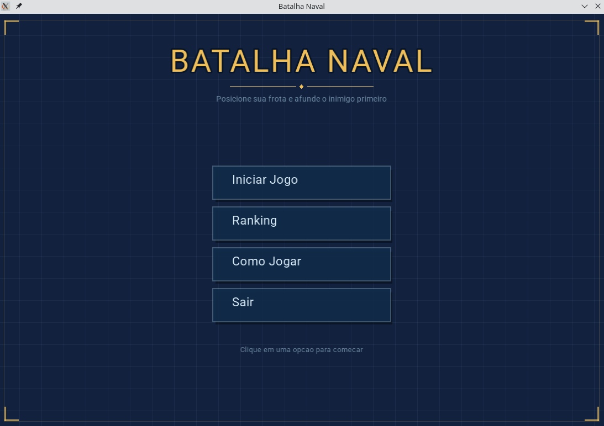
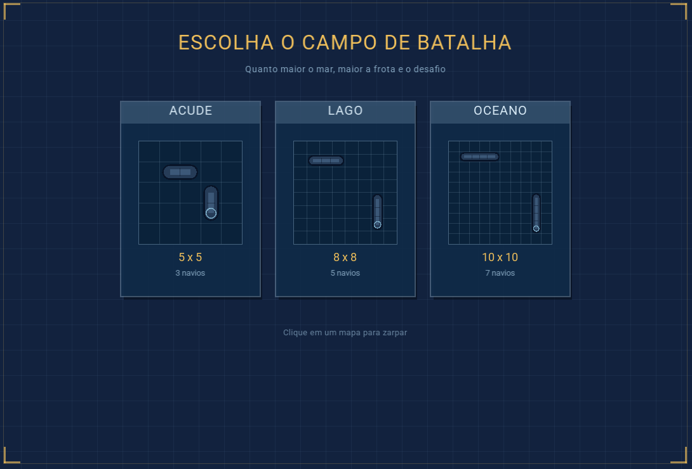
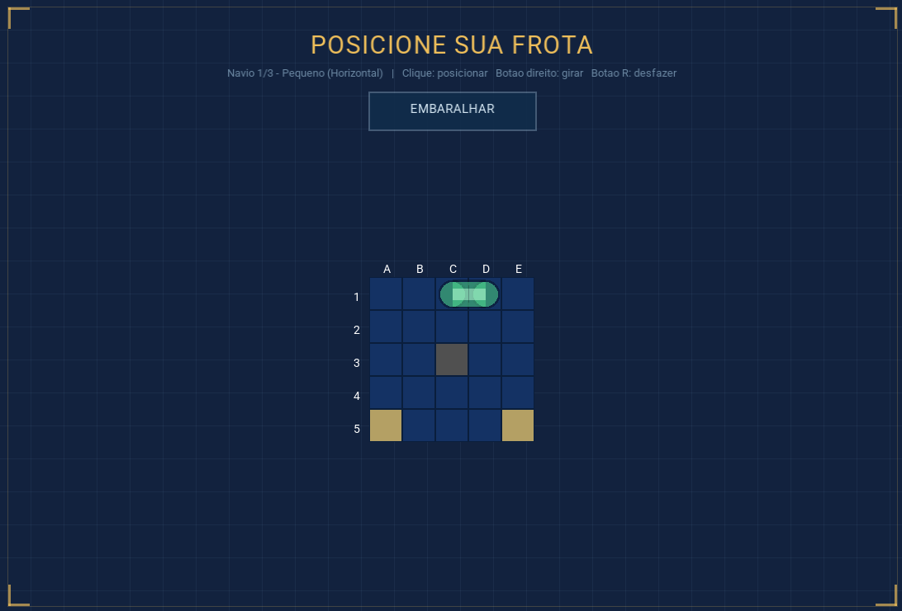
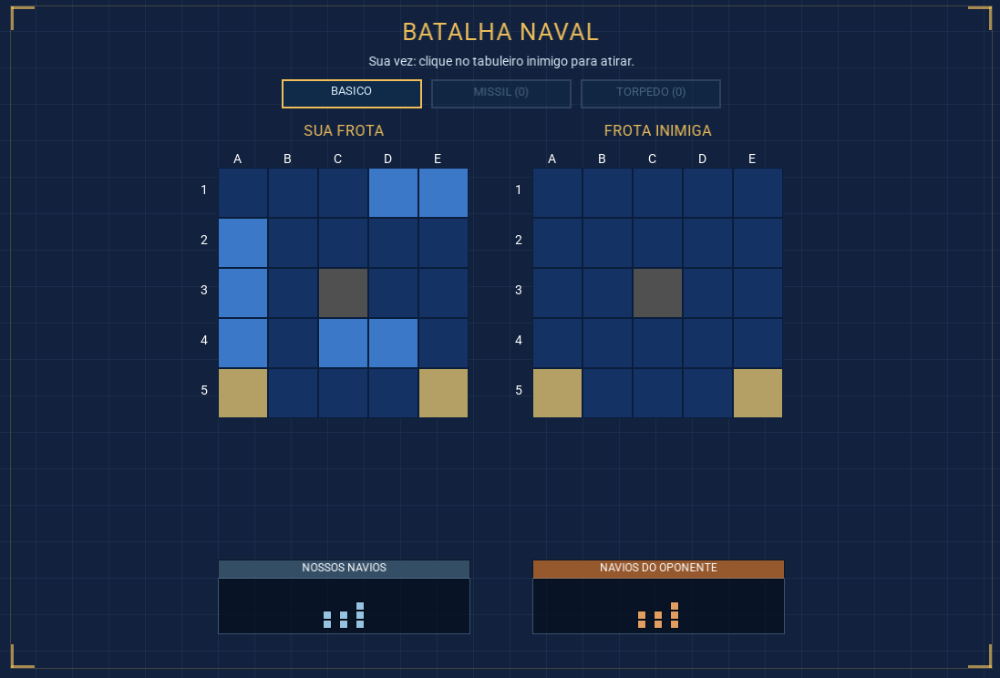
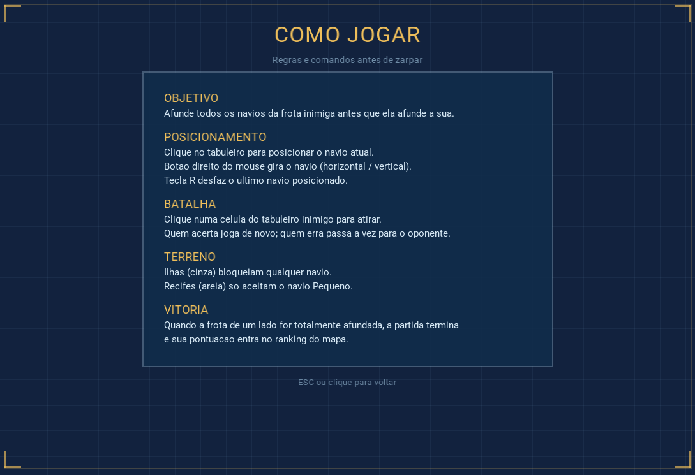

# ⚓ Batalha Naval

Jogo de Batalha Naval desenvolvido para a disciplina de Paradigmas de Programação e implementado em **C++**

## Sobre o Projeto

O objetivo central é aplicar e contrastar de forma prática os conceitos de paradigmas de linguagens (nesse caso, em POO), analisando aspectos como tipagem, gerenciamento de memória, estruturas de dados e organização de código.

## Objetivos do Sistema

O sistema visa cumprir os seguintes requisitos obrigatórios:

* **Interface e Navegação:** menu inicial interativo com opções de iniciar jogo, ranking, histórico, instruções e sair.
* **Mecânica de Tabuleiro:** uso de matrizes bidimensionais (tamanho mínimo 5x5) para posicionamento estratégico de uma frota de navios (pequenos, médios e grandes).
* **Controle de Jogadas:** entrada por coordenadas de linha e coluna com validação rígida contra jogadas repetidas ou inválidas, sob um limite restrito de tentativas (condições de vitória ou derrota).
* **Persistência de Dados:** registro completo do nome dos jogadores, histórico detalhado de partidas e geração de ranking ordenado por score.

## Telas do Jogo

| Menu Principal | Seleção de Mapa |
| :---: | :---: |
|  |  |

| Posicionamento de Frota | Tela de Batalha |
| :---: | :---: |
|  |  |

| Como Jogar (Instruções) |
| :---: |
|  |

## Stack Tecnológica

Com base na configuração do projeto, as tecnologias utilizadas foram:

### **Backend **

| Tecnologia | Versão | Propósito |
| --- | --- | --- |
| **C++** | 17 | Linguagem de programação principal, utilizando recursos modernos de gerenciamento de memória e POO. |
| **CMake** | 3.20+ | Sistema de automação de build para gerenciar a compilação do projeto. |

### **Banco de Dados**

| Tecnologia | Versão | Propósito |
| --- | --- | --- |
| **SQLite3** | 3 | Persistência de dados local (Serverless) para salvar o ranking e histórico dos jogadores. |

### **Frontend & Interface**

| Tecnologia | Versão | Propósito |
| --- | --- | --- |
| **SFML** | 3 | Biblioteca gráfica utilizada para renderizar a interface de usuário (UI), capturar eventos de mouse/teclado e gerenciar a janela do jogo. |

## Como Executar o Projeto (Guia para CLion)

Este projeto utiliza o CMake para gerenciar dependências e compilação. Para rodá-lo perfeitamente no **CLion**, siga os passos abaixo:

### 1. Clonar e Abrir

1. Clone este repositório em sua máquina local.
2. Abra o **CLion** e selecione `Open...` (Abrir).
3. Navegue até a pasta do projeto e clique em OK. O CLion carregará o `CMakeLists.txt` automaticamente.

### 2. Configurar o Diretório de Trabalho (MUITO IMPORTANTE)

Como o jogo busca arquivos de fontes (`assets/fonts/Roboto-Regular.ttf`) e o banco de dados (`data/ranking.db`) através de **caminhos relativos**, você deve configurar o diretório de execução na sua IDE para a raiz do projeto.

1. No canto superior direito do CLion (ao lado do botão de Play verde), clique na caixa de configuração que diz `BatalhaNaval` e selecione **"Edit Configurations..."**.
2. Na janela que abrir, certifique-se de que o *Target* e *Executable* estão definidos como `BatalhaNaval`.

3. Encontre o campo **"Working directory"** (Diretório de trabalho).
4. Altere esse caminho para a **pasta raiz do seu projeto** (onde fica o arquivo `CMakeLists.txt`). Por padrão, o CLion coloca dentro da pasta `cmake-build-debug`, o que causará erro ao tentar carregar a fonte ou o banco de dados.

5. Clique em **Apply** e depois em **OK**.

### 3. Compilar e Rodar

1. Certifique-se de ter as bibliotecas do **SFML** e **SQLite3** instaladas no seu sistema operacional.

2. Clique no botão de **Play (Shift + F10)** no CLion com o executável `BatalhaNaval` selecionado.

3. O jogo irá compilar e a janelinha se abrirá

## Autores

* Gabriela Andrade [(@gabiandradeal)](https://github.com/gabiandradeal)
* Georis Samuel [(@georiSamuel)](https://github.com/georiSamuel)
* Horlan Lacerda [(@Horlanlacerda)](https://github.com/Horlanlacerda)
* Suelle Maciel [(@SuelleMaciel)](https://github.com/SuelleMaciel)
